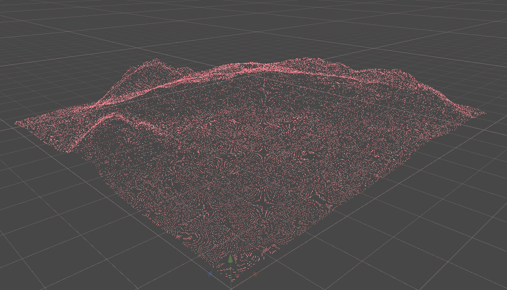

# Point renderer for Unity

Wanted to see how to create geometry shaders in Unity to render a massive amount of billboards, 
since I may need it for a future project.

Used a normal Shader Graph PBR shader, outputed the generated code and altered that to add the 
geometry shader.

Mesh is just positions and indices, points get transformed by vertex shader and fed to the geometry 
shader. Geometry shader creates a quad based on that point, with the given size.

Output color is just a red (that gets (wrongly) PBR lit (hence the pink color)), in the future I'll
probably modify the shader (starting with an unlit shader, instead of a PBR one) and create in 
fragment program a circle like shape.

In the project, I have a scriptable object with all the points (ParticleArray), this is generated
from a terrain I painted (just to have some data), with the ParticleGen script.

For my tests, there's 16 million points, running at 40 FPS on my GTX970 (mostly CPU
bound for some reason).

## License

All source code used is licensed under the [MIT license](LICENSE).
Naughty Attributes by Denis Rizov (<https://github.com/dbrizov/NaughtyAttributes>)

## Metadata

* Autor: [Diogo Andrade]

[Diogo Andrade]:https://github.com/DiogoDeAndrade
